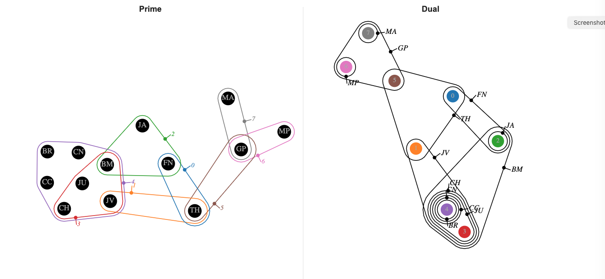
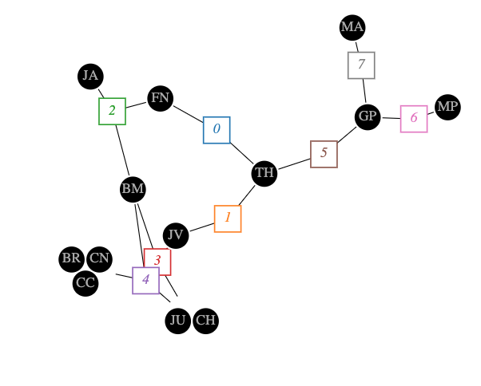
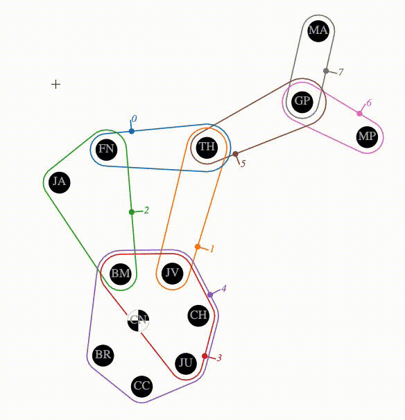
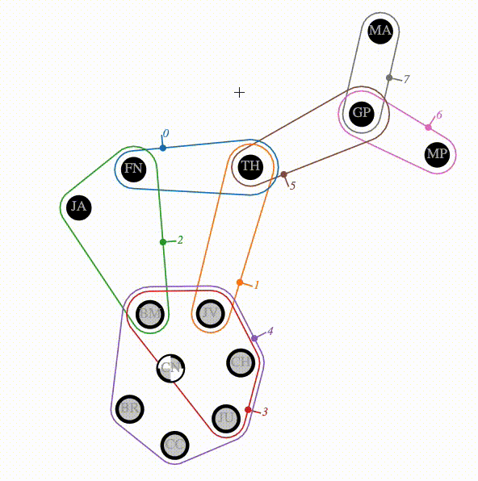

# Demo
An interactive demo of `hnxwidget` is available here: https://pnnl.github.io/hypernetx-widget/

# Installation
`hnxwidget` is now [available on PyPi](https://pypi.org/project/hnxwidget/), simply "pip install" it:

```sh
pip install hnxwidget
```

# Getting Started
After a successful installation, you can copy/paste the fragment below into a jupyter notebook cell. Executing the cell will produce an interactive hypergraph visualization. It is required that the last line of the cell returns the widget.

```py
from hnxwidget import HypernetxWidget
import hypernetx as hnx

scenes = {
    0: ('FN', 'TH'),
    1: ('TH', 'JV'),
    2: ('BM', 'FN', 'JA'),
    3: ('JV', 'JU', 'CH', 'BM'),
    4: ('JU', 'CH', 'BR', 'CN', 'CC', 'JV', 'BM'),
    5: ('TH', 'GP'),
    6: ('GP', 'MP'),
    7: ('MA', 'GP'),
}

H = hnx.Hypergraph(scenes)
HypernetxWidget(H)
```


A more in depth demonstration of the widget is found in `/notebooks/example widget.ipynb`.

# Install from source
If you just want to use the tool with the most recent updates, this installation is not recommended. Instead, see above. This installation is intended for people who are developing the JavaScript portion of the library. It will setup the Node.js environments, download packages, etc. To get setup as a developer, run 

```sh
bash setup-develop.sh
```

# How to Uninstall
```sh
jupyter nbextension uninstall hnxwidget
pip unistall hnxwidget
```
# Using the tool
The tool has two main interfaces, the hypergraph visualization and the nodes & edges panel. 

## Layout
The hypergraph visualization is an Euler diagram that shows nodes as circles and hyper edges as outlines containing the nodes/circles they contain. The visualization uses a force directed optimization to perform the layout. This algorithm is not perfect and sometimes gives results that the user might want to improve upon. The visualization allows the user to drag nodes and position them directly at any time. The algorithm will re-position any nodes that are not specified by the user. Ctrl (Windows) or Command (Mac) clicking a node will release a pinned node it to be re-positioned by the algorithm.

## Views
### Dual
`hnxwidget` allows you to view the hypergraph and its dual side-by-side. Click the "View fullscreen dual" button in the "View" toolbar to activate this feature. The screenshot below shows an example of the dual view.



### Bipartite
Instead of an Euler diagram, the hypergraph can be viewed as a bipartite graph. In this case hyper edges are represented as squares (with nodes still being represented as circles). Black lines are drawn between nodes and hyper edges to indicate that node belongs to that hyper edge. Click the "Convert to bipartite" button in the Edges toolbar to display edges this way. The screenshot below shows an example of the bipartite view.




## Selection
Nodes and edges can be selected by clicking them. Nodes and edges can be selected independently of each other, i.e., it is possible to select an edge without selecting the nodes it contains. Multiple nodes and edges can be selected, by holding down Shift while clicking. Shift clicking an already selected node will de-select it. Clicking the background will de-select all nodes and edges. Dragging a selected node will drag all selected nodes, keeping their relative placement.

Multiple nodes can be selected using the "Brush select nodes" button in the Selection toolbar. This selects all nodes within the rectangle specified by the user by dragging the brush. The animation below shows rectangular brushing of nodes.



Multiple edges can be selected using the "Brush select edges" button in the Selection toolbar. This selects all edges that contain exactly one endpoint of the brush (either the start or the end). This is useful, for example, for selecting all edges that contain a node by dragging the brush from that node to any area outside the hypergraph. The animation below shows linear brushing of edges.



Selected nodes can be hidden (having their appearance minimized) or removed completely from the visualization. Hiding a node or edge will not cause a change in the layout, wheras removing a node or edge will. The selection can also be expanded. Buttons in the toolbar allow for selecting all nodes contained within selected edges, and selecting all edges containing any selected nodes.

The toolbar also contains buttons to select all nodes (or edges), un-select all nodes (or edges), or reverse the selected nodes (or edges). An advanced user might:

* **Select all nodes not in an edge by:** select an edge, select all nodes in that edge, then reverse the selected nodes to select every node not in that edge.
* **Traverse the graph by:** selecting a start node, then alternating select all edges containing selected nodes and selecting all nodes within selected edges
* **Pin Everything by:** hitting the button to select all nodes, then drag any node slightly to activate the pinning for all nodes.

## Side Panel
Details on nodes and edges are visible in the side panel. For both nodes and edges, a table shows the node name, degree (or size for edges), its selection state, removed state, and color. These properties can also be controlled directly from this panel. The color of nodes and edges can be set in bulk here as well, for example, coloring by degree. If custom data is passed in for nodes or edges (see `example widget.ipynb`), this data can be encoded with color using the "Color by" dropdown.

## Other Features
Nodes with identical edge membership can be collapsed into a super node, which can be helpful for larger hypergraphs. Dragging any node in a super node will drag the entire super node. This feature is available as a toggle in the nodes panel.


# Notice:
This computer software was prepared by Battelle Memorial Institute, hereinafter the Contractor, under Contract No. DE-AC05-76RL01830 with the Department of Energy (DOE).  All rights in the computer software are reserved by DOE on behalf of the United States Government and the Contractor as provided in the Contract.  You are authorized to use this computer software for Governmental purposes but it is not to be released or distributed to the public.  NEITHER THE GOVERNMENT NOR THE CONTRACTOR MAKES ANY WARRANTY, EXPRESS OR IMPLIED, OR ASSUMES ANY LIABILITY FOR THE USE OF THIS SOFTWARE.  This notice including this sentence must appear on any copies of this computer software.