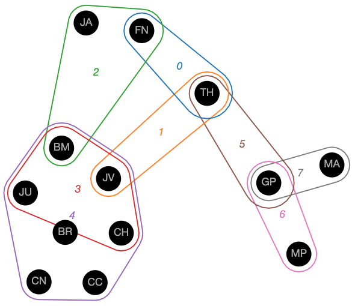

# Installation
Installation requires you to first pip install the widget, then install and activate the widget in your jupyter environment. Below, `<version>` refers to the version number of package.

```sh
pip install hnxwidget-<version>.py3-none-any.whl
jupyter nbextension install hnxwidget
jupyter nbextension enable hnxwidget
```

# Getting Started
After a successful installation, you can copy/paste the fragment below into a jupyter notebook cell. Executing the cell will produce an interactive hypergraph visualization. It is required that the last line of the cell returns the widget.
```py
from hnxwidget import HypernetxWidgetView
import hypernetx as hnx

scenes = {
    0: ('FN', 'TH'),
    1: ('TH', 'JV'),
    2: ('BM', 'FN', 'JA'),
    3: ('JV', 'JU', 'CH', 'BM'),
    4: ('JU', 'CH', 'BR', 'CN', 'CC', 'JV', 'BM'),
    5: ('TH', 'GP'),
    6: ('GP', 'MP'),
    7: ('MA', 'GP'),
}

H = hnx.Hypergraph(scenes)
HypernetxWidgetView(H)
```


A more in depth demonstration of the widget is found in `/notebooks/example widget.ipynb`.

# Other Installation Methods
## For testers
This installation is intended for people who want to test `hnx-widget` with the most recent interface (on any branch). Run the following commands.
```sh
cd widget
pip install -e .
jupyter nbextension install --py --symlink --sys-prefix hnxwidget
jupyter nbextension enable --py --sys-prefix hnxwidget
```

## For developers
If you just want to use the tool with the most recent updates, this installation is not recommended. This installation is intended for people who are developing the JavaScript portion of the library. It will setup the Node.js environments, download packages, etc. To get setup as a developer, run the `setup-develop.sh` script.

To create a universal wheel file, increment the version number in `/widget/hnxwidget/_version.py` and run 
```sh
python setup.py bdist_wheel
```

# How to Uninstall
```sh
jupyter nbextension uninstall hnxwidget
pip unistall hnxwidget
```
# Using the tool
The tool has two main interfaces, the hypergraph visualization and the nodes & edges panel. 

## Layout
The hypergraph visualization is an Euler diagram that shows nodes as circles and hyper edges as outlines containing the nodes/circles they contain. The visualization uses a force directed optimization to perform the layout. This algorithm is not perfect and sometimes gives results that the user might want to improve upon. The visualization allows the user to drag nodes and position them directly at any time. The algorithm will re-position any nodes that are not specified by the user. Ctrl (Windows) or Command (Mac) clicking a node will release a pinned node it to be re-positioned by the algorithm.

## Selection
Nodes and edges can be selected by clicking them. Nodes and edges can be selected independently of each other, i.e., it is possible to select an edge without selecting the nodes it contains. Multiple nodes and edges can be selected, by holding down Shift while clicking. Shift clicking an already selected node will de-select it. Clicking the background will de-select all nodes and edges. Dragging a selected node will drag all selected nodes, keeping their relative placement.

Selected nodes can be hidden (having their appearance minimized) or removed completely from the visualization. Hiding a node or edge will not cause a change in the layout, wheras removing a node or edge will. The selection can also be expanded. Buttons in the toolbar allow for selecting all nodes contained within selected edges, and selecting all edges containing any selected nodes.

The toolbar also contains buttons to select all nodes (or edges), un-select all nodes (or edges), or reverse the selected nodes (or edges). An advanced user might:

* **Select all nodes not in an edge by:** select an edge, select all nodes in that edge, then reverse the selected nodes to select every node not in that edge.
* **Traverse the graph by:** selecting a start node, then alternating select all edges containing selected nodes and selecting all nodes within selected edges

## Side Panel
Details on nodes and edges are visible in the side panel. For both nodes and edges, a table shows the node name, degree (or size for edges), its selection state, removed state, and color. These properties can also be controlled directly from this panel. The color of nodes and edges can be set in bulk here as well, for example, coloring by degree.

## Other Features
Nodes with identical edge membership can be collapsed into a super node, which can be helpful for larger hypergraphs. Dragging any node in a super node will drag the entire super node. This feature is available as a toggle in the nodes panel.

The hypergraph can also be visualized as a bipartite graph (similar to a traditional node-link diagram). Toggling this feature will preserve the locations of the nodes between the bipartite and the Euler diagrams.

# Notice:
This computer software was prepared by Battelle Memorial Institute, hereinafter the Contractor, under Contract No. DE-AC05-76RL01830 with the Department of Energy (DOE).  All rights in the computer software are reserved by DOE on behalf of the United States Government and the Contractor as provided in the Contract.  You are authorized to use this computer software for Governmental purposes but it is not to be released or distributed to the public.  NEITHER THE GOVERNMENT NOR THE CONTRACTOR MAKES ANY WARRANTY, EXPRESS OR IMPLIED, OR ASSUMES ANY LIABILITY FOR THE USE OF THIS SOFTWARE.  This notice including this sentence must appear on any copies of this computer software.